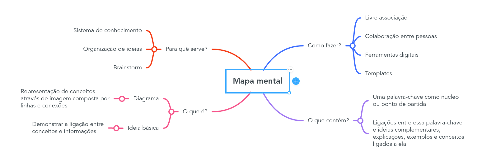
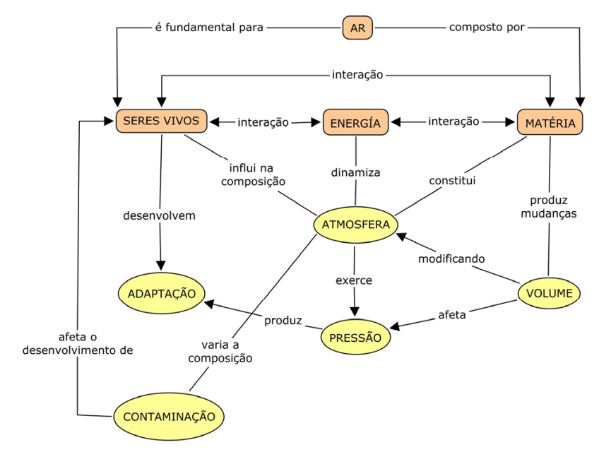
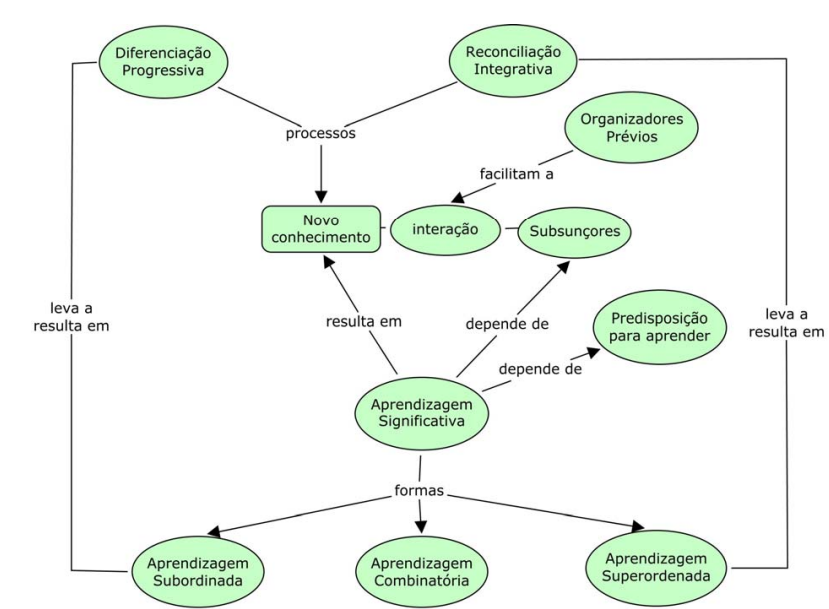
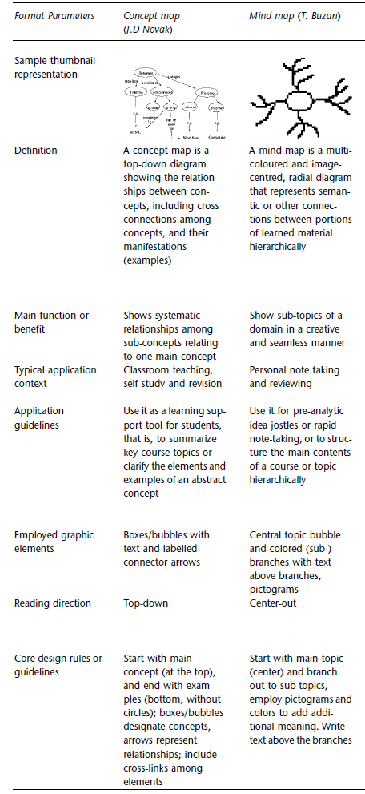

## Introdução

- Parte do treinamento promovido pelo Programa de Aperfeiçoamento do Ensino (PAE)
- Objetivo: **Auxiliar o aprendizado de genética utilizando mapas mentais**

- Breve pesquisa sobre 

{fig-align="center"}

## Conceito

- Desenvolvido por Tony Buzan em 1974, com base no conceito de *Radiant thinking*

- [TED - The Power of a Mind to Map: Tony Buzan at TEDxSquareMile](https://www.youtube.com/watch?v=nMZCghZ1hB4)

{fig-align="center" #fig-imagem1}

## Amplamente utilizado 
 
- [Estudos](https://www.youtube.com/watch?v=m1qW0wPJV1M)  
- [Organização de reuniões](Imagens/reunião de trabalho.png) 
- Planejamento de trabalhos
- Anotações durante a aula
 
## O que é um mapa mental?

## Fundamentos
 
 - *"Human languange is imagination"* = representação visual de conceitos ou de processos.
 
 - O uso de palavras-chaves é uma das maneiras mais eficazes de memorizar algo 
    - [TED - *Mind mapping for education*](https://youtu.be/_bRmXUCG7W4?si=GKveSXXDYXP7Q-vK&t=537)

   - Útil para relembrar, testar a retenção de informação, ou conectar mais informações de maneira visual ao que já se sabe.

## Outras ferramentas similares 

- [Mapas conceituais](https://www.if.ufrgs.br/~moreira/mapasport.pdf) 

::: {column-screen}

::: {.column width="50%"}
::: {.content-center}

:::
:::

::: {.column width="50%"}
::: {.content-center}

:::
:::

:::

##
{width="35%"}

## Minha proposta

**Utilização dos mapas mentais para facilitar o aprendizado de genética**

- Principais passos para construir um mapa mental

  - 1. Usar o papel na horizontal) para caber o máximo de informações possíveis)
  - 2. Definir o tema central/principal;
  - 3. As ramificações são os subtópicos do tema central;
  - 4. Descrição de palavras-chaves, definições de cada subtópico

## Minha proposta 

O ponto mais importante é pensar: **"Como posso criar um esquema que me faça lembrar sobre o assunto?"**

Dica: Não tentem usar ferramentas on-line (escrever à mão faz diferença, mesmo em tablets)

## Exemplo prático

 
## Estratégias 

- Usá-lo como uma maneira de fazer revisão antes de efetivamente estudar;
- Ir preenchendo conforme o estudo; 

## Sites para ajudar a entender como fazer um mapa mental

- University of Maine - [Creating Mind Maps](https://usm.maine.edu/learning-commons/mind-mapping/)

- Guia do estudante [Como fazer um mapa mental](https://guiadoestudante.abril.com.br/estudo/como-fazer-um-mapa-mental/)

- TED - [Want to learn better? Star mind mapping](https://www.youtube.com/watch?v=5nTuScU70As) 

- The Universitry of Adelaide - [Guia para utilização de mapas mentais](https://www.adelaide.edu.au/writingcentre/sites/default/files/docs/learningguide-mindmapping.pdf)

- The Mind Map Book

## Datas das entregas {.scrollable}

|**Datas**|**Temas da aula**|
|:----:|:---------:|
|28/ago|2ª aula - Genética da transmissão I|
|11/set|3ª aula - Genética da transmissão II + 4ª aula - Genética da transmissão III|
|18/set|5ª aula - Ligação I|
|25/set|6ª aula - Ligação II|
|02/out|7ª aula - Mutação e poliploidia|
|09/out|8ª aula - Herança extra-cromossômica|
|16/out|9ª aula - Genética Quantitativa I|
|23/out|10ª aula - Genética Quantitativa II|
|30/out|11ª aula Genética Quantitativa III|
|06/nov|feriado na semana anterior - sem atividade|
|13/nov|12ª aula - Genética de populações I|
|20/nov|13ª aula - Genética de populações II|
|27/nov|14ª aula - Genética de populações III|
|04/dez|15ª aula - Evolução|

