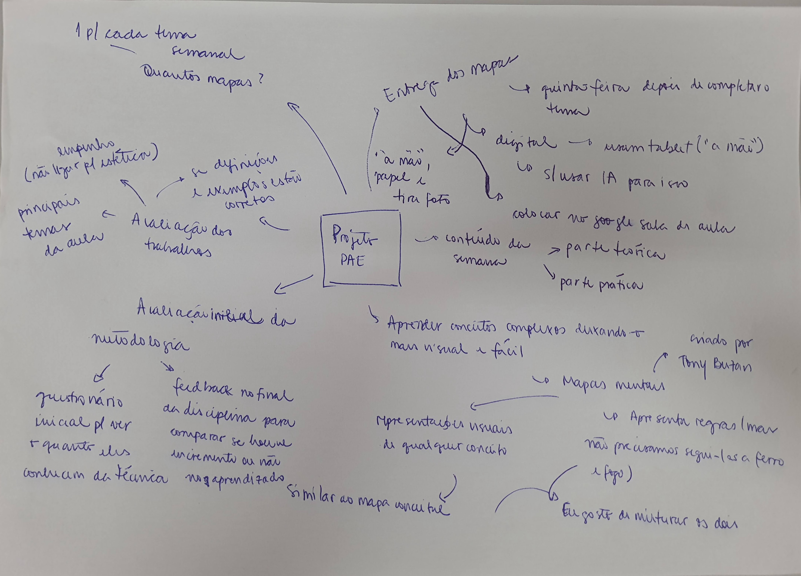

## [Introdução]{style="color: #581D22;"}
- Atividade com objetivo: **Utilização dos mapas mentais para facilitar o aprendizado de genética + divulgação de ciência para a sociedade**

[**Mapa mental + vídeo de divulgação científica**]{style="display: block; text-align: center; color: #581D22;"}

- Mapa mental $\to$ roteiro para o vídeo;
- Vídeo $\to$  divulgação da genética.

## [Breve pesquisa sobre]{style="color: #581D22;"}

{fig-align="center"}


## [O que é um mapa mental?]{style="color: #581D22;"}

- Desenvolvido por [Tony Buzan](https://www.google.com/search?q=tony+buzan&oq=tony+buzan&gs_lcrp=EgZjaHJvbWUqCggAEAAY4wIYgAQyCggAEAAY4wIYgAQyBwgBEC4YgAQyBwgCEAAYgAQyBwgDEAAYgAQyBwgEEAAYgAQyBwgFEAAYgAQyBwgGEAAYgAQyCAgHEAAYFhgeMggICBAAGBYYHjIICAkQABgWGB7SAQgyOTU2ajBqN6gCALACAA&sourceid=chrome&source=chrome.ob&ie=UTF-8) em 1974, com base no conceito de *Radiant thinking*

- [TED - The Power of a Mind to Map: Tony Buzan at TEDxSquareMile](https://www.youtube.com/watch?v=nMZCghZ1hB4)

```{r}
#| warning: false
#| echo: false
#| label: fig-toninho
#| fig-cap: Criador do conceito do mapa mental - Tony Buzan


```

## [Exemplo]{style="color: #581D22;"}

```{r}
#| warning: false
#| echo: false
#| label: fig-mapa
#| fig-cap: Exemplo de construção de mapa mental


```

## [Amplamente utilizado ]{style="color: #581D22;"}
 
- [Estudos](https://www.youtube.com/watch?v=m1qW0wPJV1M)  
- [Organização de reuniões](Imagens/reunião de trabalho.png) 
- Planejamento de trabalhos
- Anotações durante a aula
 

## [Fundamentos]{style="color: #581D22;"}
 
 - *"Human languange is imagination"* = representação visual de conceitos ou de processos.
 
 - O uso de <span style="color:#581D22;">palavras-chaves</span> é uma das maneiras mais eficazes de memorizar algo 
    - [TED - *Mind mapping for education*](https://youtu.be/_bRmXUCG7W4?si=GKveSXXDYXP7Q-vK&t=537)


   - Útil para relembrar, testar a retenção de informação, ou conectar mais informações de maneira visual ao que já se sabe.

## [Como fazer a atividade]{style="color: #581D22;"}

<span style="color:#581D22;">**1. Mapa Mental (Roteiro)**</span>

* Deve ser **feito à mão** obrigatoriamente.
* Apenas **1 mapa por grupo**, servindo como o roteiro do vídeo.


[**2. Produção do Vídeo**]{style="color: #581D22;"}

* Gravação feita com a câmera de um **celular**.
* O vídeo **não** pode ser confeccionado utilizando ferramentas de inteligência artificial.
* Use a criatividade do próprio grupo!

## [Como fazer a atividade]{style="color: #581D22;"}

[**3. Conteúdo e Formato**]{style="color: #581D22;"}

* **Duração:** Até 3 minutos (formato *Shorts*, vídeo curto gravado verticalmente).
* Explicar o conteúdo da semana descrito no mapa mental para um **público leigo** (linguagem acessível).


[**4. Envio e Entrega**]{style="color: #581D22;"}

* Publicar o vídeo prioritariamente no **YouTube**.
* Enviar o **link do vídeo** na plataforma e-Disciplinas, junto do mapa mental.

## [Exemplos do que é esperado]{style="color: #581D22;"}

```{r}
#| warning: false
#| echo: false
#| label: fig-mapa-ex1
#| fig-cap: Boa estrutura e bom uso de cores de esquemas
#| fig-align: center

knitr::include_graphics("Imagens/mapa_mental_referencia.png")
```

## [Exemplos do que é esperado]{style="color: #581D22;"}

```{r}
#| warning: false
#| echo: false
#| label: fig-mapa-ex2
#| fig-cap: Estrutura objetiva, clara e bom uso de cores
#| fig-align: center

knitr::include_graphics("Imagens/Atividade mapa mental - 2ª aula - Genética da transmissão I (28 de ago. de 2025 às 21_06).jpg")
```

## [Exemplos do que é esperado]{style="color: #581D22;"}

```{r}
#| warning: false
#| echo: false
#| label: fig-mapa-ex3
#| fig-cap: Com todos os conceitos e detalhes
#| fig-align: center

knitr::include_graphics("Imagens/20250825_204616.jpg")
```

## [Materiais de apoio]{style="color: #581D22;"}

- University of Maine - [Creating Mind Maps](https://usm.maine.edu/learning-commons/mind-mapping/)

- Guia do estudante [Como fazer um mapa mental](https://guiadoestudante.abril.com.br/estudo/como-fazer-um-mapa-mental/)

- TED - [Want to learn better? Star mind mapping](https://www.youtube.com/watch?v=5nTuScU70As) 

- The Universitry of Adelaide - [Guia para utilização de mapas mentais](https://www.adelaide.edu.au/writingcentre/sites/default/files/docs/learningguide-mindmapping.pdf)

- The Mind Map Book